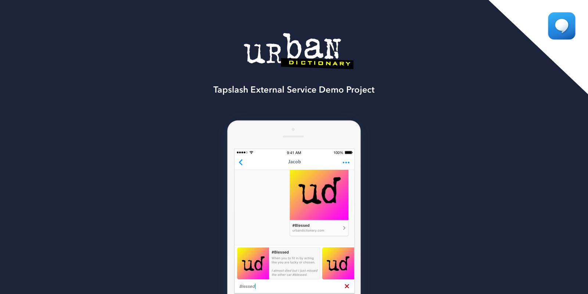

# Tapslash External Service Tutorial - Urban Dictionary (Using Flask)

This tutorial will walk you through the steps to set up and deploy an [external service](http://documentation.tapslash.com/docs/external-services).

## Get an API key for Urban Dictionary (through Mashape)

https://market.mashape.com/community/urban-dictionary

## Deploy With Heroku

[](https://heroku.com/deploy/)

**NOTE**: Heroku will give you an endpoint, substitute that with `YOUR-HEROKU-ENDPOINT`.

## Set your Urban Dictionary API key in Heroku

1. Go to your Heroku App **Settings**

2. Navigate to **Config Vars**

3. Set `MASHAPE_KEY` to your Urban Dictionary (mashape) API key.

## Test Endpoint

```
curl YOUR-HEROKU-ENDPOINT
```

should return your json data:

```
{ "results": [ { "output": "http://hacker.urbanup.com/118451", "image": { "width": "1024", "url": "https://lh5.googleusercontent.com/-rY97dP0iEo0/AAAAAAAAAAI/AAAAAAAAAGA/xm1HYqJXdMw/s0-c-k-no-ns/photo.jpg", "height": "1024" }, "uid": 118451, "display_type": "default", "title": "hacker", "url": "http://hacker.urbanup.com/118451", "detail": {}, "subtitle": "A person skilled with the use of computers that uses his talents to gain knowledge. Tere are three classifications of hackers:\r\n\r\nWhite-hat (hacking for the enjoyment of exploration)\r\n\r\nBlack-hat (hacking to find exploits and system weaknesses, see [cracker])\r\n\r\nand Grey-hat (someone who is a little of both)" }, { "output": "http://hacker.urbanup.com/323688", "image": { "width": "1024", "url": "https://lh5.googleusercontent.com/-rY97dP0iEo0/AAAAAAAAAAI/AAAAAAAAAGA/xm1HYqJXdMw/s0-c-k-no-ns/photo.jpg", "height": "1024" }
```

## Create an External Service on Tapslash

- Log in to your developer account at [Tapslash](http://developer.tapslash.com/).

- Click the dropdown menu in the top left, and select **Create**

- Click **Create A Service**

- Click **External Service**

- Set **Category** and **Description** to whatever you want.

- Set **Service Name** to whatever you want.

- Set **Service URL** to `YOUR-HEROKU-ENDPOINT`.

- Select a valid 300x300 png Flat Icon. (near the bottom)

- **Submit**

## Add the Service to Your App on Tapslash

- Navigate to your App under the dropdown menu.

- Click **Services**

- Search for the service you've just created.

- Click **Add Service**

## You're All Done!

If you have a Tapslash client pointed at this app you should see the service show up in your bar.

